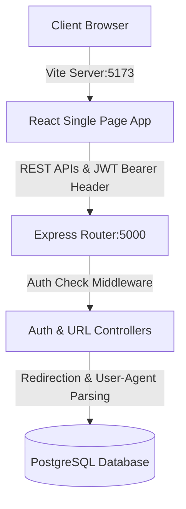

# Katomarn — Full-Stack URL Shortener & Link Intelligence Platform

Katomarn is a high-performance, full-stack URL shortener and link analytics platform. Built with a Node.js + Express backend, a PostgreSQL database, and a React + Tailwind CSS v4 frontend, it delivers robust URL tracking, expiration limits, QR Code generation, and device/browser profiling metrics via clean visual charts.

---

## 🏗️ System Architecture

The application is split into two main components:
1. **Backend Server (`/Backend`)**: A RESTful Express API that handles user authentication (JWT-based, utilizing access tokens and secure, HttpOnly refresh cookies), URL shortening logic, redirection routing, client browser/device parsing, and database transactions.
2. **Frontend client (`/FrontEnd`)**: A single-page React application powered by Vite, providing dashboard control, interactive SVG trend lines, visitor breakdowns, and styling.



---

## 🚀 Key Features

*   **Secure Session Management**: JWT Authentication with 15-minute Access Tokens and secure `HttpOnly` Refresh Cookies (silent tokens refreshing).
*   **Unique URL Shortener**: Generates unique, customizable short codes and maps them to destination endpoints.
*   **Expiration Scheduling**: Schedule optional expiration limits (date and time) when generating links. Expired links are automatically blocked with a custom `410 Gone` display page.
*   **Real-time Visitor Intelligence**: Classifies User-Agents on click redirects into device type (Desktop, Mobile, Tablet) and browser (Chrome, Safari, Firefox, Edge, etc.) and saves them with precise timestamps.
*   **Interact-to-Inspect Analytics**: Clicking on table columns inside the link console navigates directly to the visitor intelligence dashboard.
*   **Custom SVG Visualizations**: Render daily click trends (last 7 days) and browser/device breakdown graphs using zero-dependency, high-performance SVG canvas.
*   **Redesigned QR Code Generator**: Generates high-quality QR codes in a glassmorphic modal with a gradient outline and a direct client-side PNG downloader.

---

## 📁 Repository Structure

```text
Katomarn/
├── Backend/
│   ├── Controller/          # Handles REST API requests (auth, URLs, analytics)
│   ├── Database/            # Postgres schema migration.sql & db.js pool connector
│   ├── MiddleWare/          # JWT checking middleware
│   ├── Router/              # Express endpoint bindings
│   ├── Index.js             # Server entry point
│   ├── api_documentation.md # API specifications reference
│   └── .env                 # Backend configuration keys
│
├── FrontEnd/
│   ├── src/
│   │   ├── Components/      # UI (Signup, Login, Dashboard, Analytics, Header, QrModal)
│   │   ├── services/        # Fetch wrapper api.js with automated interceptors
│   │   ├── App.jsx          # Root layout and Popstate router logic
│   │   └── index.css        # Tailwind v4 imports
│   ├── package.json
│   └── vite.config.js
│
└── README.md                # General project overview
```

---

## ⚙️ Installation & Setup

### Prerequisites
*   Node.js (v18 or higher recommended)
*   PostgreSQL database instance running locally or on a server

### 1. Database Setup
Create a PostgreSQL database named `katomarn` (or whatever you prefer) and execute the SQL structure located in:
👉 **`Backend/Database/migration.sql`**

This script initializes the tables:
*   `users`: Stores credentials, names, emails, and refresh tokens.
*   `urls`: Tracks shortened links, creation dates, click counts, and expiry dates.
*   `visits`: Logs redirect events with user-agent classifications (browser/device) and timestamps.

### 2. Backend Configurations
1.  Navigate into the `Backend` directory:
    ```bash
    cd Backend
    ```
2.  Install dependencies:
    ```bash
    npm install
    ```
3.  Configure environment variables in `.env`:
    ```env
    PORT=5000
    DB_USER=your_postgres_username
    DB_PASSWORD=your_postgres_password
    DB_HOST=localhost
    DB_PORT=5432
    DB_NAME=katomarn
    JWT_ACCESS_SECRET=your_jwt_access_secret_key
    JWT_REFRESH_SECRET=your_jwt_refresh_secret_key
    FRONTEND_URL=http://localhost:5173
    NODE_ENV=development
    ```

### 3. Frontend Configurations
1.  Navigate into the `FrontEnd` directory:
    ```bash
    cd ../FrontEnd
    ```
2.  Install dependencies:
    ```bash
    npm install
    ```

---

## 🖥️ Running the Application

### Start Backend Server
Run the backend with Nodemon for hot-reloading:
```bash
cd Backend
npm run start # Or: nodemon Index.js
```
The server will run at `http://localhost:5000`.

### Start Frontend Server
Run the Vite development server:
```bash
cd FrontEnd
npm run dev
```
The client dashboard will open at `http://localhost:5173`.

---

## 🔌 API Specifications

API documentation details are located in:
👉 **[api_documentation.md]

It details payloads, methods, endpoints, response schemas, and cookie keys for endpoints:
*   `/api/auth/signup` [POST]
*   `/api/auth/login` [POST]
*   `/api/auth/refresh` [POST]
*   `/api/auth/logout` [POST]
*   `/api/auth/profile` [GET]
*   `/api/urls/shorten` [POST]
*   `/api/urls` [GET]
*   `/api/urls/:id` [DELETE]
*   `/api/urls/:id/analytics` [GET]
*   `/:shortCode` [GET] (Redirection endpoint)
