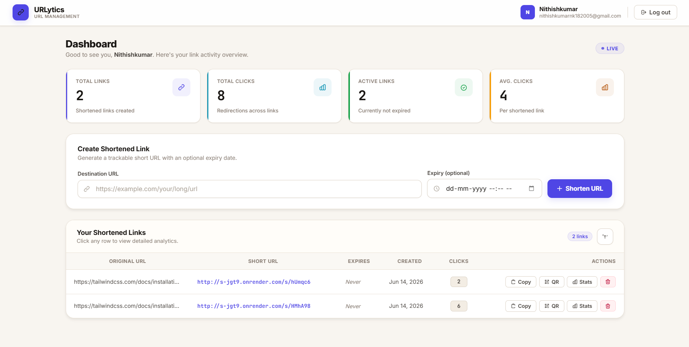
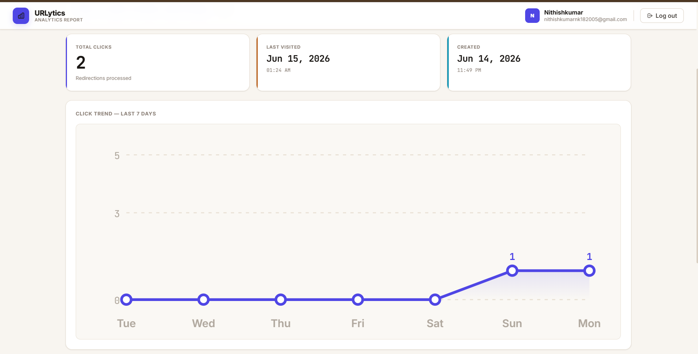
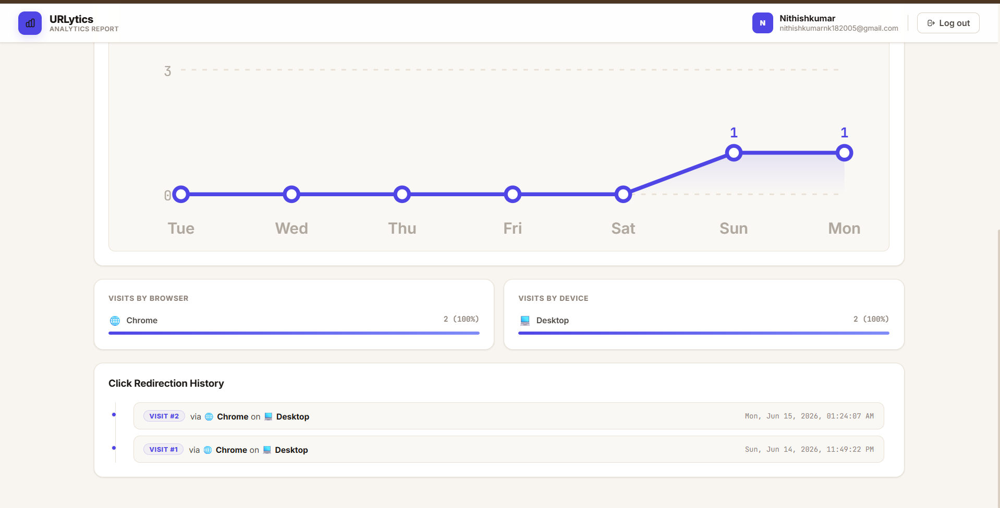
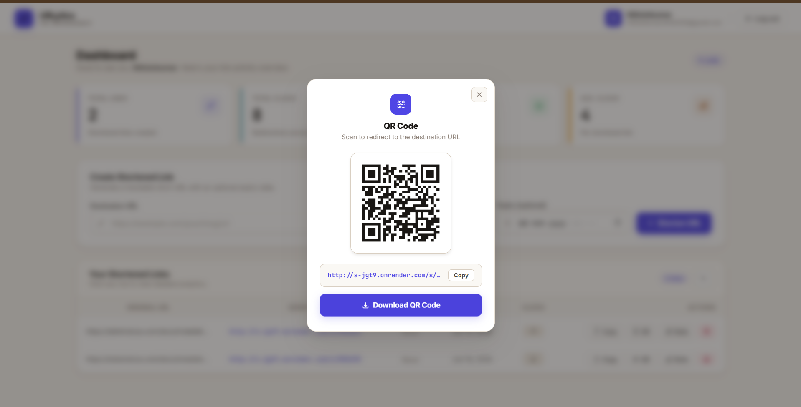

# URLytics — Full-Stack URL Shortener & Link Intelligence Platform

> 🏆 A high-performance, full-stack URL shortener with real-time link analytics, device/browser intelligence, QR code generation, and expiration scheduling — built for the Katomaran Hackathon Assessment.

---

## 🔗 Live Demo & Video

| Resource | Link |
|----------|------|
| 🌐 **Live Application** | [shorturl-wine.vercel.app](https://shorturl-wine.vercel.app) |
| 🎬 **Demo Video (YouTube)** | [Watch Video](https://youtu.be/rhg3ilG9iR4) |
| 💻 **GitHub Repository** | [Katomarans-Assesment](https://github.com/hemadarini/Katomarans-Assesment) |

---

## 📌 Table of Contents

- [Overview](#overview)
- [AI Planning Document](#ai-planning-document)
- [Architecture Diagram](#architecture-diagram)
- [Features](#features)
- [Tech Stack](#tech-stack)
- [Folder Structure](#folder-structure)
- [Setup Instructions](#setup-instructions)
- [API Reference](#api-reference)
- [Sample Output](#sample-output)
- [Assumptions Made](#assumptions-made)

---

## Overview

**URLytics** is a full-stack URL shortener and link intelligence platform that lets authenticated users generate short links, schedule expirations, inspect visitor analytics, and download QR codes — all from a clean, responsive dashboard.

---

## AI Planning Document

This project was built using an AI-assisted development workflow. Below is the documented planning process.

### Phase 1 — Requirements Breakdown

The problem was broken down into these functional modules before any code was written:

| Module | Responsibility |
|--------|---------------|
| Auth | Signup, Login, JWT access tokens + HttpOnly refresh cookies |
| URL Engine | Short code generation, uniqueness check, redirect handling |
| Expiry System | Optional expiry date scheduling, `410 Gone` response for expired links |
| Analytics Engine | Visit logging with timestamp, browser, and device classification |
| Dashboard UI | Table of all links with click count, created date, copy & delete actions |
| Analytics UI | Per-link detail page with trend chart, browser/device breakdown |
| QR Generator | Modal-based QR code render with PNG download |

### Phase 2 — Feature List

**Mandatory Features Implemented:**
- [x] User Signup and Login with hashed passwords (bcrypt)
- [x] JWT-based protected routes (15-min access token + silent refresh)
- [x] Each user manages only their own URLs
- [x] Long URL → unique short code generation
- [x] URL validation before shortening
- [x] Server-side redirect on short code hit
- [x] Dashboard: original URL, short URL, created date, total clicks
- [x] Delete a shortened URL
- [x] Copy short URL from UI with one click
- [x] Total click count per link
- [x] Last visited timestamp
- [x] Recent visit history per link
- [x] Responsive UI with loading, success, and error states
- [x] Form validation messages

**Bonus Features Implemented:**
- [x] QR Code generation with glassmorphic modal + PNG download
- [x] Expiry date/time scheduling (links auto-block after expiry with `410 Gone`)
- [x] Device type analytics (Desktop / Mobile / Tablet)
- [x] Browser analytics (Chrome / Firefox / Safari / Edge)
- [x] Daily click trend chart (last 7 days) — custom SVG, zero dependencies
- [x] Deployment with live demo (Vercel frontend + Render backend)

### Phase 3 — AI Prompting Strategy

AI tools were used to:
- Generate Express middleware for JWT verification and silent refresh
- Write the User-Agent parsing logic for device/browser classification
- Build custom SVG chart components for analytics visualization
- Design the glassmorphic QR code modal


---

## Architecture Diagram

```
┌─────────────────────────────────────────────────────────────┐
│                      CLIENT BROWSER                          │
│                                                             │
│   React SPA (Vite) — http://localhost:5173                  │
│   Components: Login, Signup, Dashboard, Analytics,          │
│               Header, QrModal                               │
│   services/api.js — Fetch wrapper with JWT interceptors     │
└──────────────────────────┬──────────────────────────────────┘
                           │ REST API + JWT Bearer Header
                           │ (Access Token: 15 min)
                           │ (Refresh Token: HttpOnly Cookie)
                           ▼
┌─────────────────────────────────────────────────────────────┐
│               EXPRESS SERVER — Port 5000                     │
│                                                             │
│  ┌─────────────┐   ┌──────────────┐   ┌─────────────────┐  │
│  │ Auth Router │   │  URL Router  │   │ Redirect Router │  │
│  │  /api/auth  │   │  /api/urls   │   │  /:shortCode    │  │
│  └──────┬──────┘   └──────┬───────┘   └────────┬────────┘  │
│         │                 │                    │            │
│         └─────────────────┼────────────────────┘            │
│                           │                                 │
│              ┌────────────▼──────────────┐                  │
│              │   JWT Auth Middleware      │                  │
│              │   User-Agent Parser        │                  │
│              └────────────┬──────────────┘                  │
└───────────────────────────┼─────────────────────────────────┘
                            │ SQL Queries (pg pool)
                            ▼
┌─────────────────────────────────────────────────────────────┐
│                  POSTGRESQL DATABASE                         │
│                                                             │
│  ┌─────────────┐  ┌──────────────────┐  ┌───────────────┐  │
│  │    users    │  │       urls       │  │    visits     │  │
│  │─────────────│  │──────────────────│  │───────────────│  │
│  │ id          │  │ id               │  │ id            │  │
│  │ name        │  │ user_id (FK)     │  │ url_id (FK)   │  │
│  │ email       │  │ original_url     │  │ browser       │  │
│  │ password    │  │ short_code       │  │ device        │  │
│  │ refresh_tok │  │ click_count      │  │ visited_at    │  │
│  └─────────────┘  │ created_at       │  └───────────────┘  │
│                   │ expires_at       │                      │
│                   └──────────────────┘                      │
└─────────────────────────────────────────────────────────────┘
```

**Data Flow — Redirect with Analytics Capture:**
```
User clicks short URL
       │
       ▼
Express /:shortCode handler
       │
       ├─→ Look up short_code in urls table
       │
       ├─→ Check expires_at → if expired → return 410 Gone page
       │
       ├─→ Parse User-Agent → extract browser + device type
       │
       ├─→ INSERT into visits (url_id, browser, device, visited_at)
       │
       ├─→ INCREMENT urls.click_count
       │
       └─→ HTTP 302 redirect to original_url
```

---

## Features

### 🔐 Secure Authentication
- JWT access tokens (15-minute lifespan) + silent token refresh via secure `HttpOnly` cookies
- Passwords hashed with bcrypt before storage
- Protected routes — each user sees only their own links

### 🔗 URL Shortening
- Generates unique short codes mapped to destination URLs
- Input validation before shortening (rejects malformed URLs)
- Server-side redirect handling via Express

### ⏰ Expiration Scheduling
- Optional expiry date + time set at link creation
- Expired links return a custom `410 Gone` page — no redirect
- Active/expired status visible in the dashboard

### 📊 Analytics & Visitor Intelligence
- Every redirect logs: browser name, device type, precise timestamp
- Per-link analytics page shows:
  - Total click count
  - Last visited time
  - Full recent visit history table
  - 7-day daily click trend (custom SVG chart)
  - Browser & device breakdown (custom SVG bar charts)

### 📋 Dashboard
- View all shortened URLs with original URL, short URL, created date, click count
- One-click copy of short URL
- Delete any link
- Click any row → navigate directly to that link's analytics

### 📱 QR Code Generator
- Glassmorphic modal with gradient border
- High-quality QR code rendered per link
- One-click PNG download on client side

---

## Tech Stack

| Layer | Technology |
|-------|-----------|
| **Frontend** | React 18, Vite, Tailwind CSS v4 |
| **Backend** | Node.js, Express.js |
| **Database** | PostgreSQL |
| **Auth** | JWT (access + refresh), bcrypt |
| **Analytics** | Custom SVG charts (zero external dependencies) |
| **QR Code** | Client-side QR generation |
| **Deployment** | Vercel (Frontend), Render (Backend) |

---

## Folder Structure

```
URLytics/
├── Backend/
│   ├── Controller/
│   │   ├── authController.js      # Signup, login, refresh, logout, profile
│   │   └── urlController.js       # Shorten, list, delete, analytics, redirect
│   ├── Database/
│   │   ├── migration.sql          # PostgreSQL schema (users, urls, visits)
│   │   └── db.js                  # pg connection pool
│   ├── MiddleWare/
│   │   └── authMiddleware.js      # JWT verification middleware
│   ├── Router/
│   │   ├── authRouter.js          # /api/auth routes
│   │   └── urlRouter.js           # /api/urls routes + /:shortCode redirect
│   ├── Index.js                   # Server entry point
│   ├── api_documentation.md       # Full API spec
│   └── .env                       # Environment variables
│
├── FrontEnd/
│   ├── src/
│   │   ├── Components/
│   │   │   ├── Signup.jsx         # Registration form
│   │   │   ├── Login.jsx          # Login form
│   │   │   ├── Dashboard.jsx      # Main link management table
│   │   │   ├── Analytics.jsx      # Per-link analytics & charts
│   │   │   ├── Header.jsx         # Navigation bar
│   │   │   └── QrModal.jsx        # QR code generator modal
│   │   ├── services/
│   │   │   └── api.js             # Fetch wrapper with JWT interceptors
│   │   ├── App.jsx                # Root layout + Popstate router
│   │   └── index.css              # Tailwind v4 imports
│   ├── package.json
│   └── vite.config.js
│
└── README.md
```

---

## Setup Instructions

### Prerequisites
- Node.js v18 or higher
- PostgreSQL running locally or on a server
- npm

---

### Step 1 — Database Setup

Create a PostgreSQL database and run the schema:

```bash
psql -U your_postgres_username -c "CREATE DATABASE URLytics;"
psql -U your_postgres_username -d URLytics -f Backend/Database/migration.sql
```

This creates three tables:
- `users` — credentials, name, email, hashed password, refresh token
- `urls` — short codes, original URLs, click counts, expiry dates, owner user ID
- `visits` — per-click logs with browser, device type, and timestamp

---

### Step 2 — Backend Setup

```bash
cd Backend
npm install
```

Create a `.env` file in the `Backend/` directory:

```env
PORT=5000
DB_USER=your_postgres_username
DB_PASSWORD=your_postgres_password
DB_HOST=localhost
DB_PORT=5432
DB_NAME=URLytics
JWT_ACCESS_SECRET=your_jwt_access_secret_key
JWT_REFRESH_SECRET=your_jwt_refresh_secret_key
FRONTEND_URL=http://localhost:5173
NODE_ENV=development
```

Start the backend server:

```bash
npm run start
# or
nodemon Index.js
```

The API server runs at: `http://localhost:5000`

---

### Step 3 — Frontend Setup

```bash
cd FrontEnd
npm install
npm run dev
```

The React dashboard opens at: `http://localhost:5173`

---

## API Reference

| Method | Endpoint | Auth | Description |
|--------|----------|------|-------------|
| POST | `/api/auth/signup` | ❌ | Register a new user |
| POST | `/api/auth/login` | ❌ | Login, returns access token + sets refresh cookie |
| POST | `/api/auth/refresh` | Cookie | Issue new access token silently |
| POST | `/api/auth/logout` | ✅ | Clear refresh cookie |
| GET | `/api/auth/profile` | ✅ | Get logged-in user details |
| POST | `/api/urls/shorten` | ✅ | Create a shortened URL |
| GET | `/api/urls` | ✅ | Get all URLs for the current user |
| DELETE | `/api/urls/:id` | ✅ | Delete a URL by ID |
| GET | `/api/urls/:id/analytics` | ✅ | Get click analytics for a URL |
| GET | `/:shortCode` | ❌ | Redirect to original URL (logs visit) |

Full payload schemas and response formats are documented in `Backend/api_documentation.md`.

---

## Sample Output


### Dashboard View



### Analytics Page




### QR Code Modal



### Database Entries

**users table:**
```
 id |    name     |        email         | refresh_token
----+-------------+----------------------+--------------
  1 | Hemadarini  | hema@example.com     | eyJhbGci...
```

**urls table:**
```
 id | user_id | short_code | click_count |     created_at      |     expires_at
----+---------+------------+-------------+---------------------+--------------------
  1 |       1 | abc123     |          14 | 2026-06-10 08:22:01 | 2026-07-01 00:00:00
  2 |       1 | xyz789     |           3 | 2026-06-12 14:10:45 | NULL
```

**visits table:**
```
 id | url_id | browser | device  |      visited_at
----+--------+---------+---------+---------------------
  1 |      1 | Chrome  | Desktop | 2026-06-13 09:14:22
  2 |      1 | Safari  | Mobile  | 2026-06-13 11:05:10
  3 |      2 | Firefox | Desktop | 2026-06-14 16:30:44
```

### Server Logs (Backend Console)
```
[Server] Listening on port 5000
[POST /api/auth/login] 200 — user: hema@example.com
[GET  /api/urls] 200 — 2 URLs returned for user_id: 1
[GET  /abc123] User-Agent parsed: Chrome / Desktop
[GET  /abc123] 302 → https://original-long-url.com
[GET  /expired-code] 410 Gone — link expired
```

---

## Assumptions Made

1. **Short codes are auto-generated** — Custom aliases are not supported in this version. Short codes are randomly generated and guaranteed unique via a database uniqueness check.

2. **Single base URL for redirects** — All short links are served from the same backend domain. The frontend displays the full short URL by combining the backend base URL with the short code.

3. **Token refresh is silent** — When an access token expires (15 minutes), the frontend automatically calls `/api/auth/refresh` using the `HttpOnly` refresh cookie, with no user interruption.

4. **Visit logging is server-side only** — Browser and device type are parsed from the `User-Agent` header on the backend at redirect time. No client-side tracking scripts are used.

5. **Expiry is checked at redirect time** — Expired links are not pre-deleted from the database. The redirect handler checks `expires_at` at the time of the request and returns `410 Gone` if expired.

6. **No geolocation tracking** — IP-based geolocation was not implemented. Analytics cover browser and device type only.

7. **PostgreSQL is required** — The application is designed specifically for PostgreSQL and uses pg-specific syntax. MongoDB is not supported.

8. **Environment variables are mandatory** — The app will not start without a valid `.env` file. No default secrets are hardcoded.

9. **Single-user session per browser** — Only one account can be logged in at a time per browser session, managed via the HttpOnly cookie.

10. **Charts use no external libraries** — All SVG visualizations (trend lines, browser/device breakdowns) are built from scratch using raw SVG for zero additional bundle size.

---

> This project is a part of a hackathon run by https://katomaran.com
